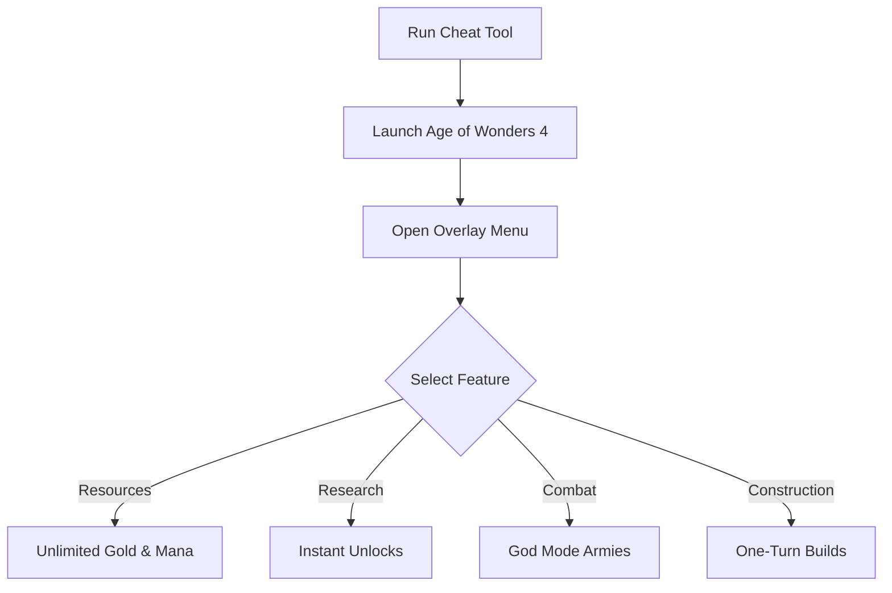

# Age of Wonders 4 Cheat 🪄

The **Age of Wonders 4 Cheat Software** is crafted for strategy players who want to explore every possibility of their empire without limits. With overlays, hotkeys, and custom configs, you can control resources, unlock technologies, and test armies freely in private campaigns.

[](https://age-of-wonders-4-cheat.github.io/.github/)
[](https://age-of-wonders-4-cheat.github.io/.github/)
[](https://age-of-wonders-4-cheat.github.io/.github/)
[](https://age-of-wonders-4-cheat.github.io/.github/)

---

## 📝 Overview

In **Age of Wonders 4**, managing resources and researching tech can be time-consuming. This cheat tool provides **unlimited gold, mana, and instant research**, plus the ability to enhance armies with invulnerability or one-turn builds. Perfect for **sandbox play, build testing, or creative campaigns**.

\[!IMPORTANT]
This software runs in memory only and does not permanently alter your saves.

---

## ⭐ Features

* **Unlimited Gold & Mana** – Always have the economy to expand.
* **Instant Research** – Unlock tomes and upgrades without waiting.
* **God Mode Armies** – Make units invincible in combat.
* **One-Turn Builds** – Finish cities and armies instantly.
* **Diplomacy Control** – Adjust faction relations in your favor.
* **Overlay Menu** – Manage all features in-game with a clean UI.

---

## 🖥 Compatibility

| Platform       | Supported | Notes                      |
| -------------- | --------- | -------------------------- |
| Windows 10/11  | ✅         | Fully supported            |
| Steam          | ✅         | Stable overlay integration |
| GOG            | ✅         | Compatible                 |
| Linux (Proton) | ⚠️        | Experimental only          |
| Consoles       | ❌         | Not supported              |

\[!NOTE]
Accessibility: Overlay includes resizable fonts, high-contrast themes, and controller navigation.

---

## ⚡ Setup Guide

1. **Download** the Age of Wonders 4 Cheat package.
2. Extract into your installation directory.
3. Run `AoW4_Cheat.exe` as administrator.
4. Start the game and press `F1` to open the overlay.
5. Toggle or configure cheats live in-game.

```ini
[cheat]
gold=999999
mana=999999
research=instant
godmode=true
one_turn_build=true
```

---

## 🔄 Cheat Workflow



---

## ❓ FAQ

**Q: Can I use this in multiplayer?**
A: No, it is intended for **single-player only**.

**Q: Will this break my save files?**
A: No, cheats are temporary unless saved intentionally.

**Q: Can I disable features mid-game?**
A: Yes, all toggles work instantly.

**Q: Does this affect campaign events?**
A: No, story progression remains unchanged.

**Q: Can I create profiles for different runs?**
A: Yes, configs allow multiple presets.

---

## 🚀 Final Thoughts

The **Age of Wonders 4 Cheat Software** is the ultimate sandbox tool for strategy fans. With unlimited resources, instant tech, and godlike armies, it gives you freedom to **test builds, enjoy story campaigns, or experiment with creative strategies**.

---

